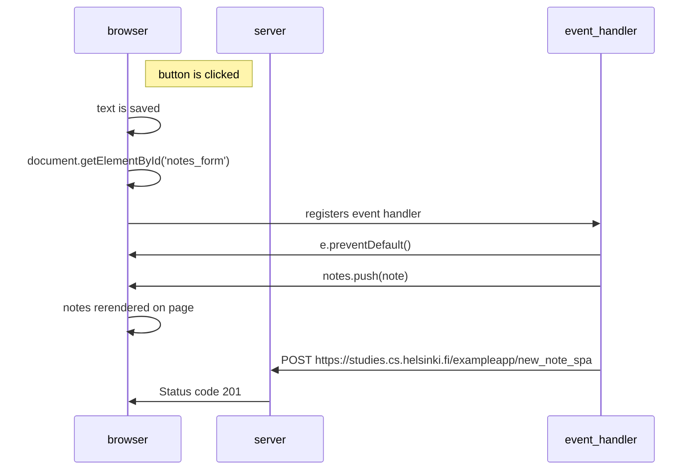

```mermaid
sequenceDiagram
    participant browser
    participant server
    participant event_handler

    Note right of browser: button is clicked
    browser->>browser: text is saved
    browser->>browser: document.getElementById('notes_form') 
    browser->>event_handler: registers event handler
    event_handler->>browser: e.preventDefault()
    event_handler->>browser: notes.push(note)
    browser->>browser: notes rerendered on page
    event_handler->>server: POST https://studies.cs.helsinki.fi/exampleapp/new_note_spa
    server->>browser: Status code 201

```