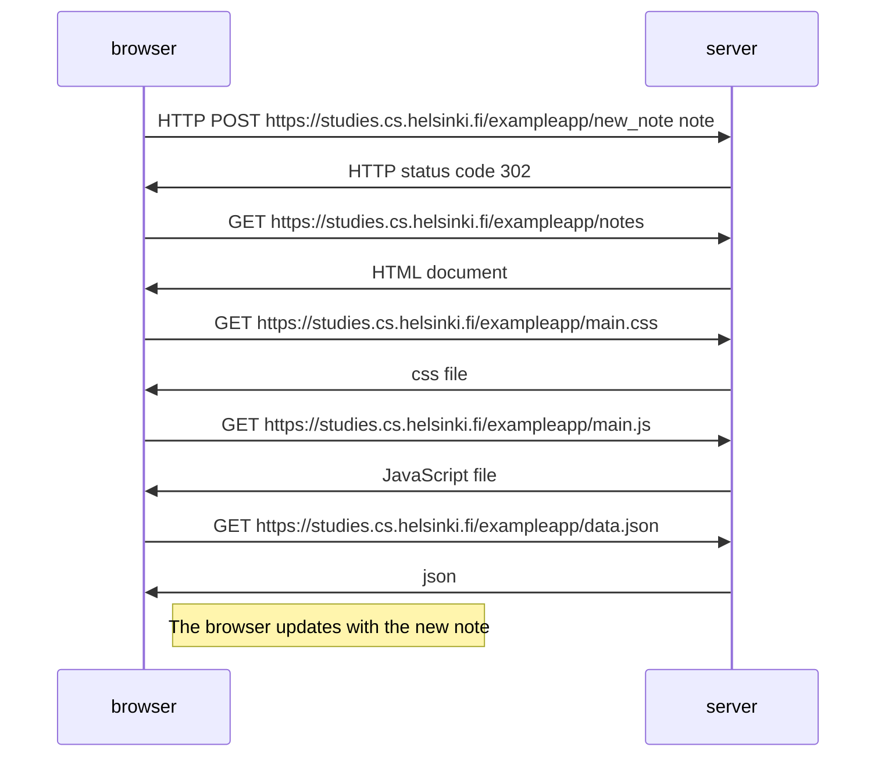

```mermaid
sequenceDiagram
    participant browser
    participant server
    browser->>server: HTTP POST https://studies.cs.helsinki.fi/exampleapp/new_note note
    server->>browser: HTTP status code 302
    browser->>server: GET https://studies.cs.helsinki.fi/exampleapp/notes
    server->>browser: HTML document
    browser->> server: GET https://studies.cs.helsinki.fi/exampleapp/main.css
    server->> browser: css file 
    browser->> server: GET https://studies.cs.helsinki.fi/exampleapp/main.js 
    server->> browser: JavaScript file
    browser->>server: GET https://studies.cs.helsinki.fi/exampleapp/data.json
    server->>browser: json

    Note right of browser: The browser updates with the new note
```